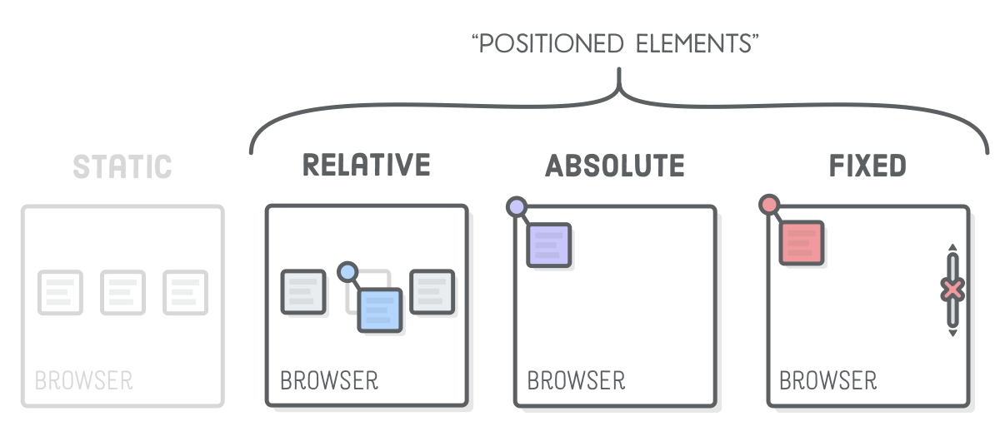
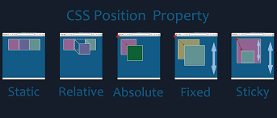

# CSS Position

There are five different types of css positions

1. static: it is the default css position.
2. relative: relative to it's normal positon. we can use top, right, left, top and bottom properties for relative css position.It leves a gap at it's normal position.
3. absolute: relative to it's first positioned(not static) ancestor(parent) element.
4. fixed: relative to the browser window.
5. sticky: relative to the user scroll's position.

# we can also understand the css positions from below diagrams.

